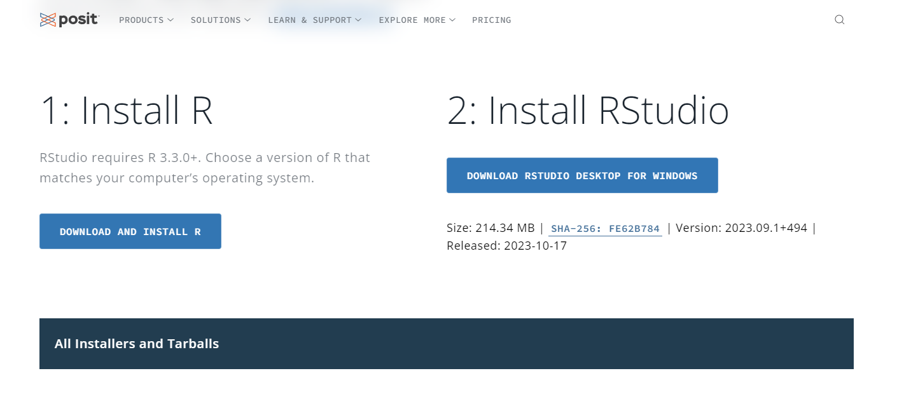
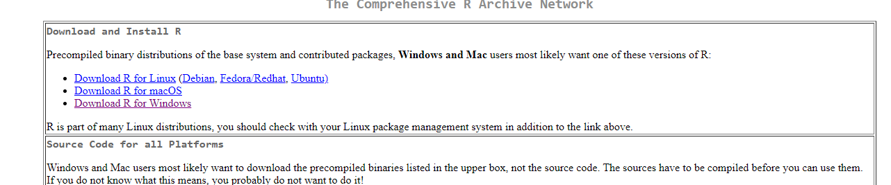

```{r setup, include=FALSE}
knitr::opts_chunk$set(echo = TRUE)

#install.packages("devtools")
#devtools::install_github("juba/rdmformats")
```

💻*¡Bienvenidos al Taller introductorio: R para Cientistas Sociales!*
💻.

A a lo largo de esta jornada abordaremos el uso de R para las ciencias
sociales. **No se requiere experiencia previa en programación ni
análisis de datos,** ya que este taller está diseñado para todxs, desde
principiantes hasta aquellos con cierta experiencia.

🤔 **¿Por qué R?** R es un lenguaje de programación ampliamente
utilizado en la ciencia de datos, estadísticas y análisis de datos. En
las ciencias sociales, R puede ser una herramienta invaluable para
explorar datos, identificar patrones, y comunicar tus hallazgos de
manera efectiva estudies la carrera que estudies.

**Podes acceder al repositorio
[acá](https://github.com/ariibard/R-para-Ciencias-Sociales)**. Allí
vamos a estar subiendo los archivos y documentos del curso.

➡️ Este taller es organizado por el proyecto de investigación *"La trama
territorial de programas sociales en el conurbano bonaerense: entre
nación, municipios y organizaciones sociales (2015-2023)" r*adicado en
el Departamento de Derecho y Ciencia Política de la **Universidad
Nacional de La Matanza** (UNLaM).


{width="212" align="right"}

# Instalación de R y RStudio

#### Instalación de R

1️⃣ Para descargar R y Rstudio, debes acceder a la página de intalación
de [Posit](https://posit.co/download/rstudio-desktop/).



2️⃣ Lo primero que debemos hacer es **instalar R**. Para ello,
seleccionaremos el **paso 1** que te llevara a la [página de
CRAN](https://cran.rstudio.com/) (Comprehensive R Archive Network) que
es el *repositorio central de software de R*. Allí, deberás seleccionar
el *sistema operativo que utilices*.



3️⃣ Luego deberás seleccionar el "install for the first time" (Instalar
por primera vez) en la parte superior de la página:


#### Instalación de R Studio

4️⃣ Una vez que lo descargas, deberás ejecutar el .exe y seguir los pasos
de la instalación. La última versión de R es la 9.1.

5️⃣En cuanto hayas descargado R, deberás descargar RStudio que es el IDE
que estaremos usando a lo largo del curso.

Para ello vuelve a la [página de
posit](https://posit.co/download/rstudio-desktop/) y selecciona el Paso
2.


También podés seleccionar la opción de descarga que mejor se adapte a tu
sistema operativo


¡Felicidades! Ahora tienes R y RStudio instalados en tu compu. En caso
de tener algún inconveniente no dudes en escribirnos.

📅 **Nos vemos el 23 de noviembre a las 17 30 hs en la biblioteca de la
UNLaM para continuar con este taller**

✨ En esta página estaremos subiendo lo que veremos ese día ✨

# ¿Con qué trabajamos en R?

-   **Scripts**: Un script de R es un archivo de texto que contiene
    código R.

-   **Rmarkdown**: Un documento **Rmd** es un archivo de texto que
    combina texto con código R. Este formato de documento se utiliza
    para crear informes, presentaciones y otros tipos de documentos que
    contienen tanto texto como código. Podés aprender más de rmarkdown
    [acá](https://rmarkdown.rstudio.com/) y de Quarto (un tipo de
    documento parecido y más chevere [acá](https://quarto.org/))

➡️ Si apretamos las teclas ALT+CTRL+I podemos introducir un **chunk**.
*Es como un mini script,* un espacio para procesar código en R. para
ejecutar el código hacemos clic en el [**botón
verde**]{style="color:green"}

➡️ También podemos correr lineas de código usando CTRL + ENTER

```{r}
# Esto es un comentario. Para comentar usamos el # o CTRL + ALT + C


```

Uno puede editar la estructura del documento

## Esto es un titulo

### Esto es un titulo mas chiquito

#### Esto es un título mini

Esto es texto normal

*Esto es texto en cursiva*

**Esto es texto en negrita**

# En R todo es un objetos

R es un lenguaje orientado a objetos, lo que significa que todo en R es
un objeto. Incluso los números, las funciones y los datos son objetos
("cosas") en R.

➡️ Los objetos se crean con **\<-** o el signo

```{r}
# Creamos un objeto en R

esto_es_un_objeto <- 23
esto_tambien <- "Usamos comillas para el texto para que ningun elemento este suelto"
```

También podemos crear objetos con muchos objetos llamados **vectores**

```{r}
esto_es_un_vector <- c(1,2,3,4,5,6,7,8,9,10,11,12,13,14,15,16,17)

```

# R es una calculadora

Podemos hacer operaciones matemáticas con R. Y, podemos operar con los
objetos

```{r}

# suma
1 + 3

# resta
4-2

# division
25/5

# multiplicacion
2*2

# potencia
2^2

```

A su vez, podes operar con tus objetos, vectores, dataframes...

```{r}
# suma con mi objeto

esto_es_un_objeto + 5

# Puedo crear un objeto con lo nuevo 
objeto_nuevo <- esto_es_un_objeto + 5


```

Y usar funciones de R o de librerías para calculos. Las **funciones**
como `sum()` o `mean()` son bloques de código reutilizables que realizan
tareas específicas. R tiene muchas funciones incorporadas y también
podes crear las tuyas propias. *Además hay librerías y paquetes que te
permiten ampliar este universo de funciones*

```{r}

# Tambien operar con mis vectores

mean(esto_es_un_vector)
sum(esto_es_un_vector)
```

Podemos graficar nuestro vector con la función `plot()`

```{r}
plot(esto_es_un_vector)
```

# Levantar data

📂 En R podemos utilizar archivos csv, txt, excel, sav, entre otros.
Incluso podes trabajar con
[googlesheets!](https://googlesheets4.tidyverse.org/reference/index.html)

❗Para cada tipo de archivo hay una función diferente. CSV `read.csv()`
, archivos SAV `read_spss()` , excel `readxl::read_excel()`

Vamos a trabajar con [*datos
abiertos*](https://datosabiertos.desarrollosocial.gob.ar/dataset/potenciar-trabajo)
del **Programa Nacional de Inclusión Socioproductiva y Desarrollo Local
"Potenciar Trabajo"** que fue creado en el año 2020 bajo la Resolución
N° 121. Este programa busca es contribuir al mejoramiento de la
empleabilidad y la generación de nuevas propuestas productivas. Para
ello, se prevé la participación de las y los titulares del programa en
al menos una de las tres alternativas:

-   proyectos socio-productivos;

-   terminalidad educativa;

-   proyectos socio-laborales o socio-comunitarios

```{r}
#Defino url
#url <- ("https://datosabiertos.desarrollosocial.gob.ar/dataset/d45687c0-f2ba-41d9-9989-0ad9799308ae/resource/c5c925e0-7ce0-41e5-b3ff-8ebb51d4be72/download/potenciar-trabajo-titulares-2022-10-01.csv")
# 
#potenciar_trabajo <- read.csv(url)

potenciar_trabajo <- read.csv("data/potenciar-trabajo-titulares-2022-10-01.csv")
```

Para descargarlo a nuestro espacio de trabajo usamos la funcion
`write.csv()` para CSV o `write.xlsx` de la librería `openxlsx`

```{r}

# Guardo el csv
write.csv(potenciar_trabajo, "data/df_potenciar.csv")
```

para leer el archivo desde nuestra compu:

```{r}

# Leo el df 
df <- read.csv("df_potenciar.csv")
```

Pueden encontrar más información sobre importacion y exportacion de
archivos [aquí](https://r-coder.com/exportar-datos-r/) o
[aquí](https://myrbooksp.netlify.app/import.html)

# Analizamos el potenciar trabajo

Primero vamos a ver qué hay en el df del potenciar trabajo

```{r}
# Primeras 10 observaciones
head(df) 

# Ultimas 10 observaciones
tail(df)
```

Con el simbolo \$ puedo elegir las variables de mi tabla y a cada una de
ellas puedo aplicarle una función

```{r}
max(df$titulares) #máximo de titulares

min(df$titulares) #mínimo de minimo de titulares

```

Para saber más acerca de una función podes pedirle ayuda a R con:

```{r}
#?max
#help(max)
```

Ver un resumen de los datos

```{r}
str(df)
summary(df)
```

# Graficamos

Para graficar usamos `ggplot2`, es un paquete que se encuentra dentro de
Tidyverse.

`Tidyverse` es un conjunto de paquetes en R diseñados para la ciencia de
datos. Estos paquetes comprenden funciones que facilitan el proceso de
importación, limpieza, transformación, visualización, modelado y
comunicación de datos. Pueden explorarlos mediante la
[documentación](https://www.tidyverse.org/packages/)

```{r}
# install.packages("tidyverse")

library(tidyverse) # Activamos el paquete
```

Para instalar un paquete usamos `install.packages("nombre_del_paquete")`
y siempre SIEMPRE que necesitamos usarlo hay que llamarlo en nuestra
sesión o documento con `library(nombre_del_paquete)`

Existe una interfaz interactiva que permite dar los primeros pasos en
este mundo de la visualización. El paquete `esquisse` te permite hacer
un boceto del gráfico y luego copiar el codigo en tu trabajo a través de
la función `esquisser`

```{r}
#instalaremos el paquete esquisse

#install.packages("esquisse") #instalamos el paquete, por unica vez

library(esquisse)
# Otra forma de llamar a las funciones de los paquetes esquisse::esquisser()
#esquisser(df) #corremos la funcion de visualizacion


# Gráfico resultante

ggplot(df) +
  aes(x = periodo, weight = titulares) +
  geom_bar(fill = "#36B08E") +
  labs(
    x = "Cantidad",
    y = "Período",
    title = "Titulares del potenciar trabajo por año",
    subtitle = "Cantidad de titulares (2021-2023)",
    caption = "Fuente: Datos abiertos del MDSN"
  ) +
  theme_classic() +
  theme(
    plot.title = element_text(size = 16L,
    face = "bold",
    hjust = 0.5),
    plot.subtitle = element_text(size = 15L,
    hjust = 0.5)
  )
```

# Presentación

Accedé a la presentación
[acá](https://arianabard.netlify.app/posts/rparacientistassociales/)


## Fuente

-   [R en 90
    minutos](https://www.nucleodeinnovacion.com/post/nis-en-la-facultad-de-ciencias-sociales-con-r-en-90-minutos) -
    Nucleo de Innovación Social (NIS)

-   [Introducción al Análisis de Datos en
    R](https://github.com/elateneoac/cursoR_2023) - el Ateneo A.C
    
    
{width="212" align="right"}